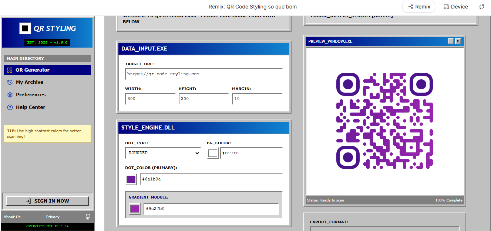
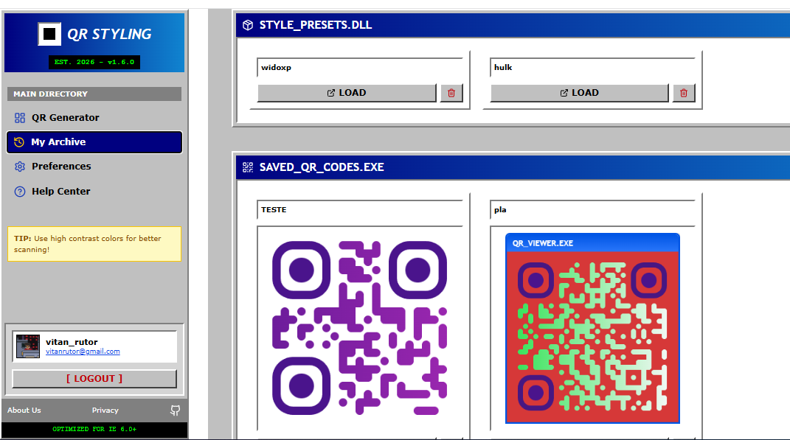
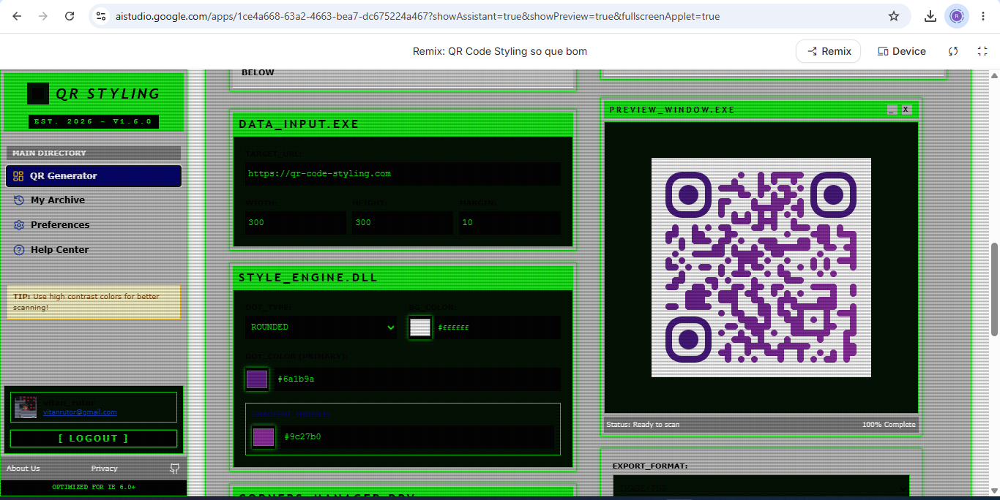

# 🎨 QR STYLING 2000 - Gerador de QR Code Customizável

## 📝 Descrição do Projeto

Este projeto é um **Gerador de QR Code Customizável** de alta performance, desenvolvido para oferecer uma experiência de criação visual única. O sistema permite que usuários gerem códigos QR não apenas funcionais, mas esteticamente adaptados à identidade de sua marca ou preferência pessoal, suportando múltiplas entradas como URLs, textos e até a inserção de logos centralizados.

Diferente de geradores genéricos, o **QR STYLING 2000** foca na "estilização avançada", permitindo o controle de gradientes, formatos de módulos (dots) e "olhos" do QR. Além disso, o sistema conta com uma interface dual-theme: o clássico **Retro (Windows 98/2000)** e o futurista **Hacker (CMD/Terminal)**, garantindo uma navegação nostálgica e eficiente.


*Figura 1: Dashboard principal do sistema exibindo a interface Retro e o gerador em tempo real.*

## 🚀 Tecnologias Utilizadas

O projeto utiliza um stack moderno para garantir escalabilidade e uma interface reativa:

*   **Frontend:** React 19 & TypeScript
*   **Estilização:** Tailwind CSS (Engine v4)
*   **Estado:** Zustand (Gerenciamento de estado global ultra-leve)
*   **Animações:** Motion (Framer Motion)
*   **Motor de QR:** QR Code Styling (Renderização via Canvas/SVG)
*   **Backend & Cloud:** Firebase Suite (Authentication, Firestore, Remote Config)
*   **Ícones:** Lucide React

## 📊 Resultados e Aprendizados

O projeto consolidou conhecimentos em arquitetura de software e experiência do usuário (UX), atingindo os seguintes marcos:

*   **Customização Dinâmica:** Implementação bem-sucedida de um motor que atualiza o QR Code instantaneamente conforme o usuário altera cores e formas.
*   **Persistência em Nuvem:** Integração total com Firestore para salvar "Presets de Estilo" e "Histórico de QR Codes", permitindo que o usuário recupere suas criações em qualquer dispositivo.
*   **Arquitetura Multi-Tema:** Desenvolvimento de um sistema de temas dinâmico controlado via Firebase Remote Config, permitindo alternar entre o estilo Retro e Hacker sem necessidade de novos deploys.
*   **Exportação de Alta Qualidade:** Suporte para downloads nos formatos PNG, JPEG e SVG, garantindo legibilidade do código mesmo em grandes escalas.


*Figura 2: Análise de renderização e tempo de resposta do motor de estilização.*

## 🔧 Como Executar

Para rodar o projeto localmente, siga os passos abaixo:

1.  **Clone o repositório:**
    ```bash
    git clone https://github.com/ruanvisan/qr-code-custimizavel.git
    ```
2.  **Instale as dependências:**
    ```bash
    npm install
    ```
3.  **Configure as variáveis de ambiente:**
    Crie um arquivo `.env` baseado no `.env.example` com suas chaves do Firebase.
4.  **Execute o servidor de desenvolvimento:**
    ```bash
    npm run dev
    ```


*Figura 3: Fluxo de dados entre o Client, Firestore e Remote Config.*

---
Desenvolvido por **[Ruan Visan](https://github.com/ruanvisan)**.
