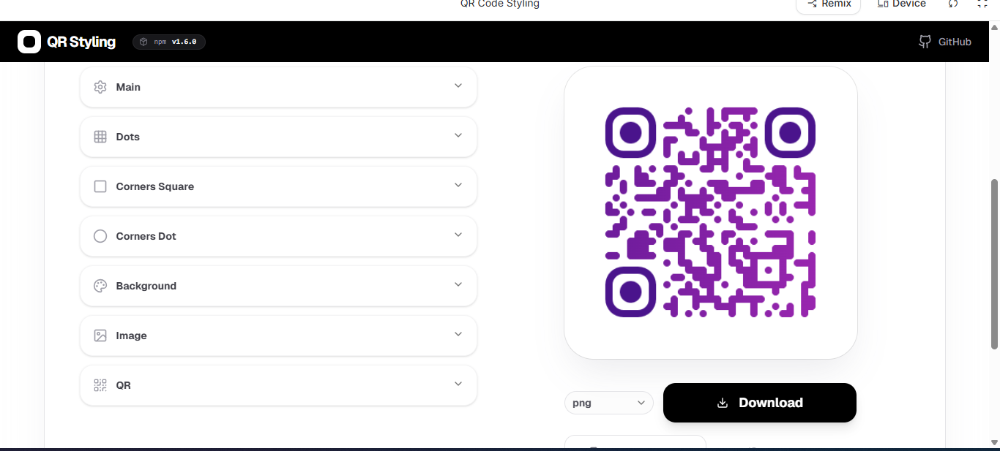

# 🎨 QR Code Styling - Gerador de QR Code Customizável

## 📝 Descrição do Projeto
Este projeto é um gerador de QR Codes profissional e altamente customizável, inspirado na library `qr-code-styling`. O objetivo principal é transformar QR Codes genéricos em peças de design únicas que respeitam a identidade visual de marcas e projetos, permitindo ajustes finos em geometrias, cores e logotipos.

Desenvolvido para oferecer uma experiência de **Rapid Prototyping (Vibecoding)**, o sistema utiliza um motor de renderização robusto em conjunto com uma interface baseada em Shadcn/UI, permitindo a criação de códigos escaneáveis com gradientes complexos e estilização de cantos em tempo real.


*Figura 1: Interface principal do sistema exibindo a customização dinâmica e preview real-time.*

## 🚀 Tecnologias Utilizadas
* **Framework:** React 19 + Vite
* **Linguagem:** TypeScript (Strict Type Safety)
* **Estilização:** Tailwind CSS & Framer Motion (animações de interface)
* **Estado Global:** Zustand
* **Core Engine:** qr-code-styling
* **Componentes:** Shadcn/UI & Lucide React (ícones)

## 📊 Funcionalidades e Diferenciais
O projeto foca em alta coesão e baixo acoplamento, garantindo uma performance fluida mesmo com múltiplos updates simultâneos.
* **Customização Atômica:** Controle total sobre os pontos (dots), molduras (corners square) e centros (corners dot).
* **Motor de Gradientes:** Suporte a gradientes lineares e radiais que se refletem instantaneamente no background do site via Context API.
* **Branding Seguro:** Algoritmos de correção de erro (L, M, Q, H) que garantem a leitura mesmo com logos centralizados.
* **Exportação Polimórfica:** Suporte para downloads em formatos raster (PNG, JPEG) e vetoriais (SVG) para impressão de alta qualidade.

## 🔧 Como Executar
1. Clone o repositório.
2. Instale as dependências:
```bash
npm install
```
3. Inicie o servidor de desenvolvimento:
```bash
npm run dev
```
4. Para gerar o build de produção:
```bash
npm run build
```

---
[Voltar ao topo](#-qr-code-styling---gerador-de-qr-code-customizável) | Desenvolvido com foco em UI/UX e Clean Code.
